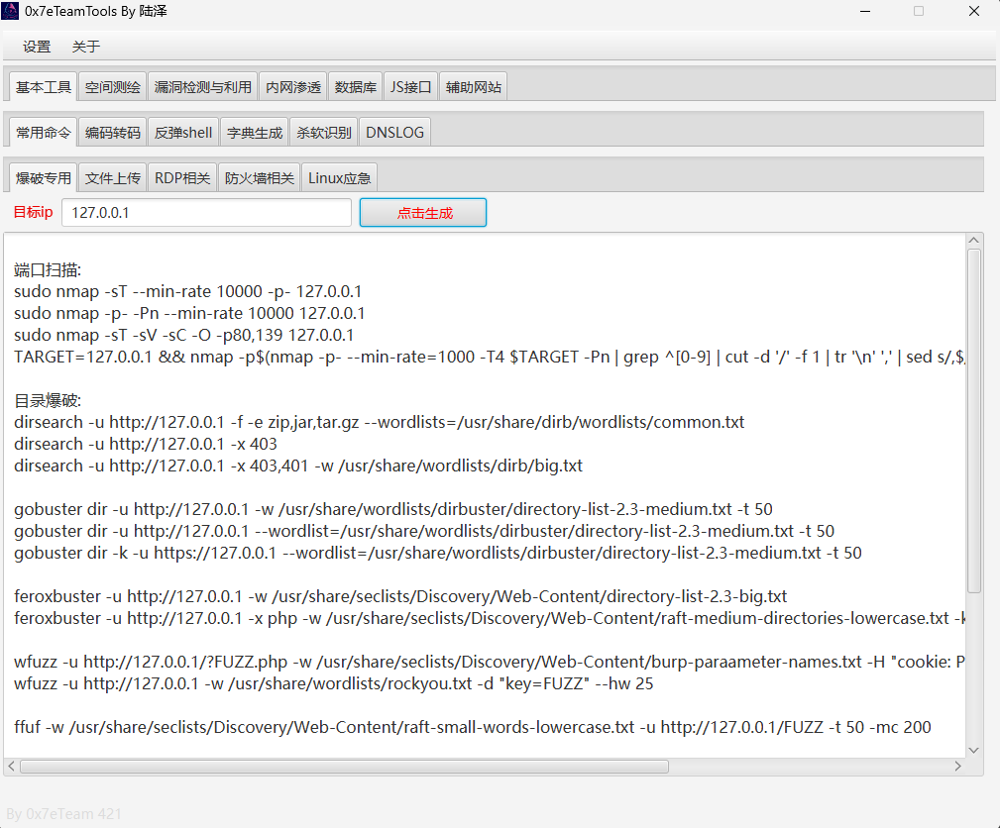
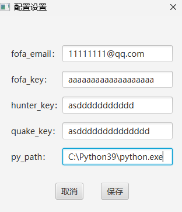
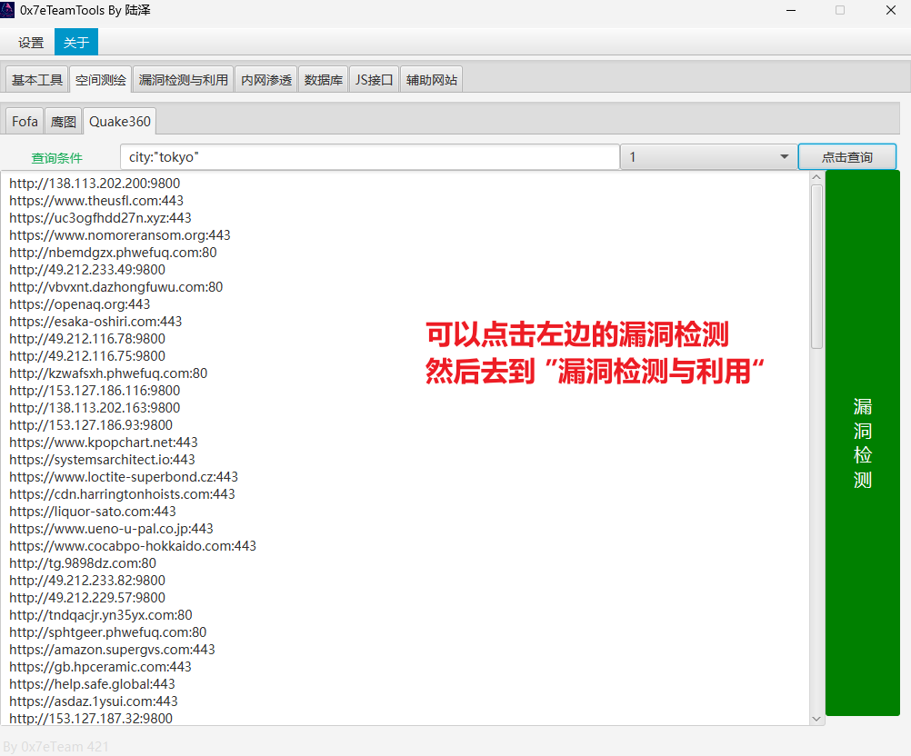
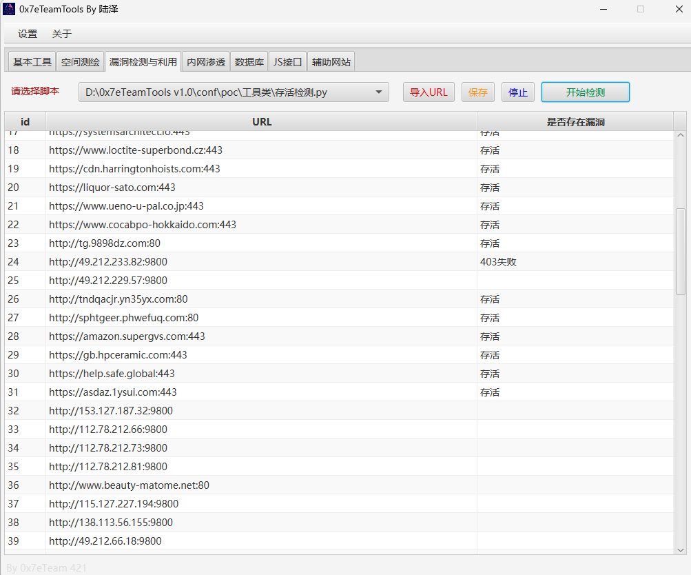
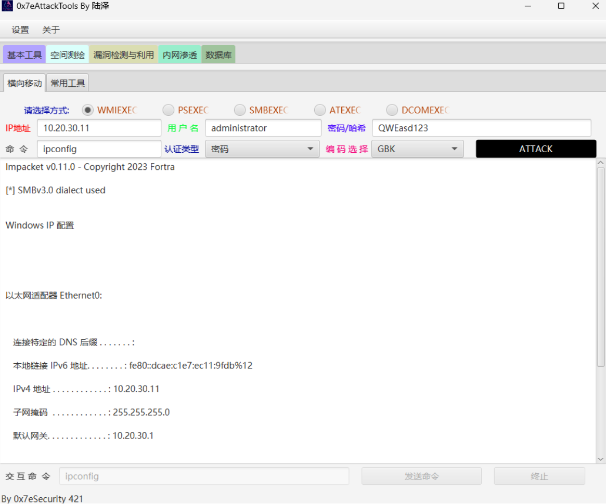
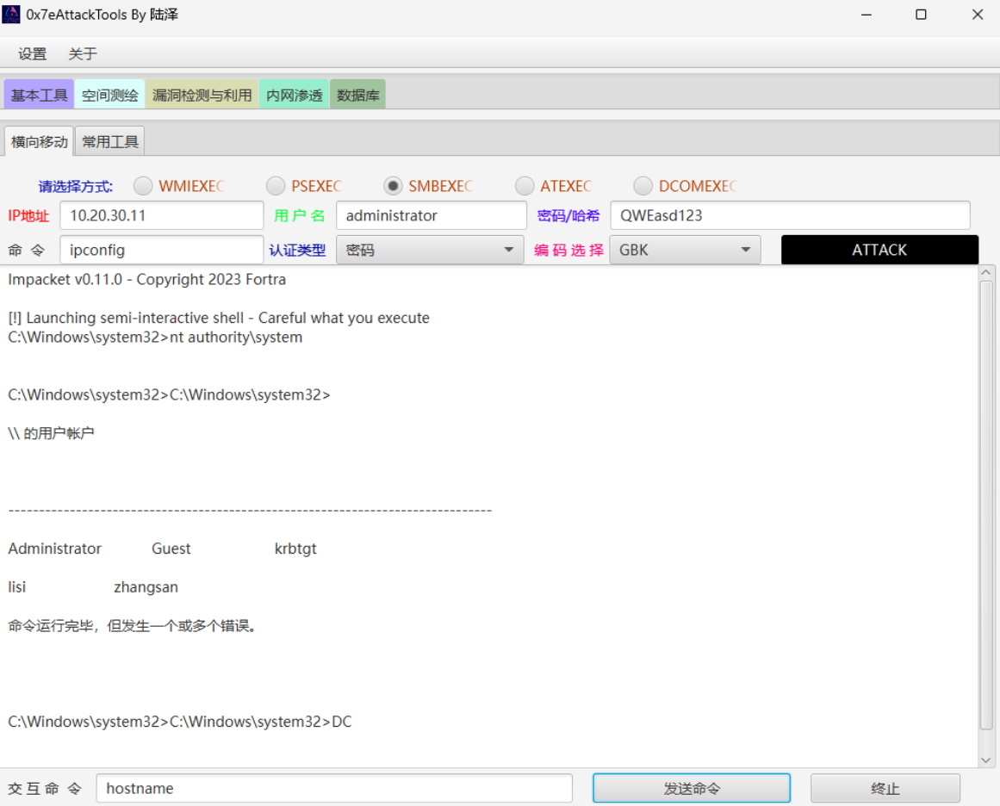
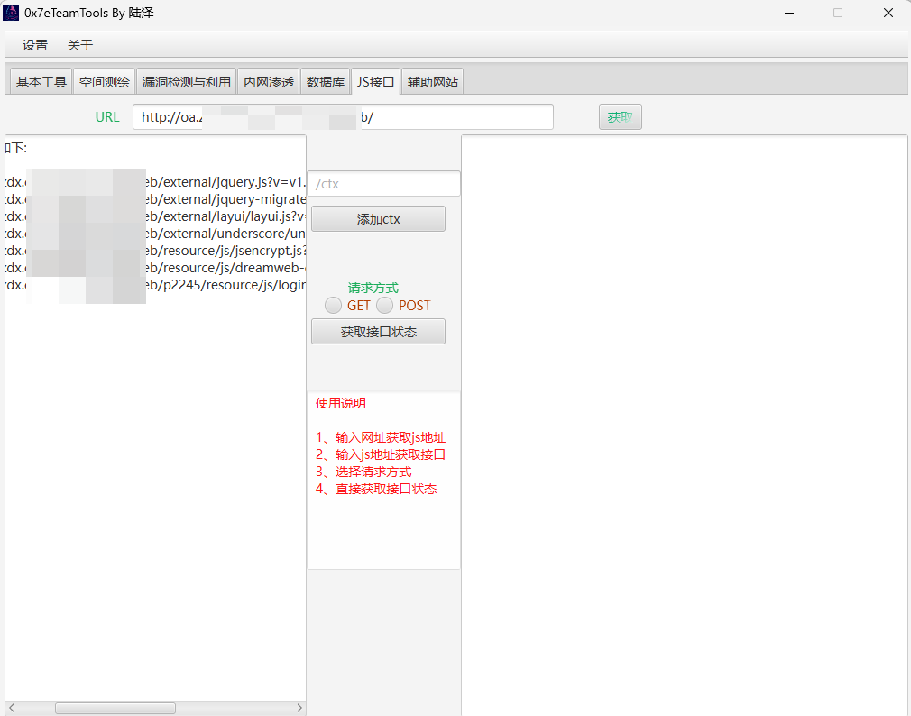
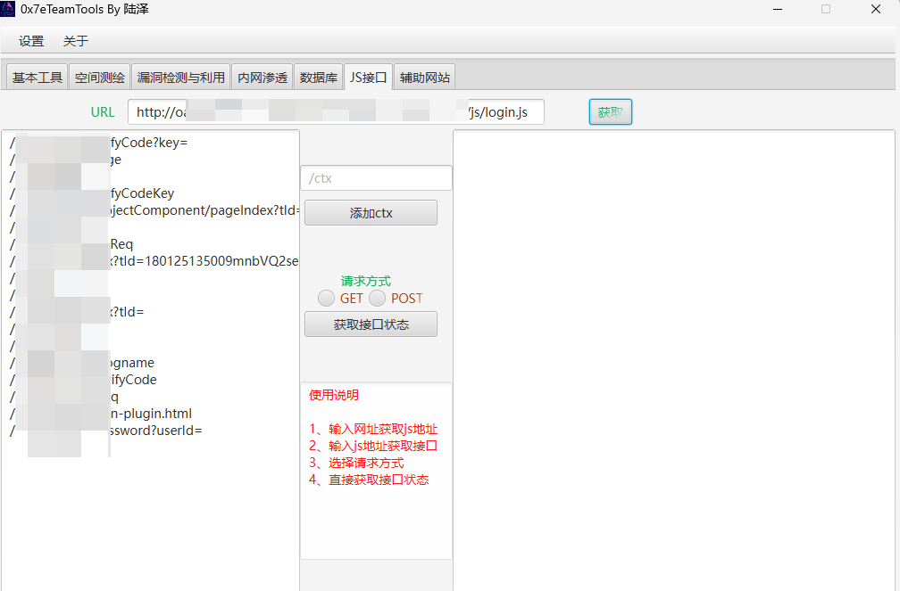
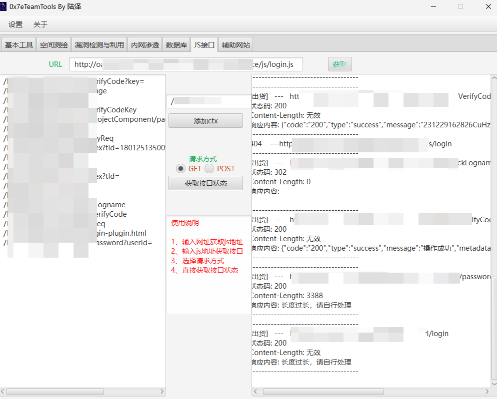

# 0x7eTeamTools

## 更新记录

0x7eTeamTools V1.1
         2024年1月12日
            
            1、修复了反弹shell命令生成功能bug
            2、修复了某些页面鼠标滚轮功能bug
            3、新增了js接口的一些处理逻辑
              3.1针对型如../xx.js、./xx.js、//xx.js等js爬取做了修复
              3.2针对型如../func、./func、/func等接口处理做了修复

## 一、软件介绍

该工具就是作者练习javafx的产物，并没有高深莫测的功能，给自己的礼物。

基本内容

设置 

​			代理-----推荐socks

​			API配置

基本工具

​			常用命令（爆破、文件上传、RDP相关、防火墙相关、Linux应急）

​			编码转换（Base64、Unicode、url编码、字符串反转、ASCII、rot13、摩斯）

​			反弹shell

​			字典生成

​			杀软识别

​			 DNSLOG(命令执行场景、SQL注入场景、XXE场景、其余中间件场景)

空间测绘

​			FoFa

​			鹰图

​			Quake360

漏洞检测与利用

​			调用py脚本，可以导入url,也可以从空间测绘send过来

内网渗透

​			横向移动(impacket-0.11.0的聚合)

​			PTT

​          密码喷洒

数据库

​			MYSQL

​          ORACLE

JS接口

​			实现从网址导出js,从js导出接口，接口的存活探测

辅助网站

​			一些常用的渗透辅助站点收集

## 二、软件使用

其余功能比较简单，只介绍漏洞检测和JS接口

### 漏洞检测

第一步：先配置各种API

第二步：选择一个空间测绘

第三步：选择自己的脚本，检测即可

脚本编写要求【可以参考模板】

​	1、要求只从控制台获取一个参数，内容是url

   2、检测的结果请输出之控制台

   3、代理需要自己加到py里面

### 内网横向

py调用的`impacket-0.11.0`

### JS接口

第一步：输入网址 获取js

第二步，挑选一个感觉有接口的js

这里的js不能有参数

第三步：(可选)，观察结果，如果有特定的目录，可以添加在前面

第四步：选择请求方式，然后点击`获取接口状态`即可

结果

有建议和需求可提 ISSUE 
